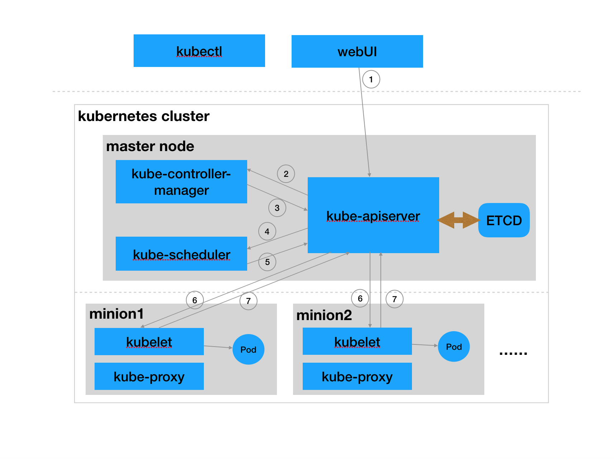

### 1. 写在前面
kubernetes作为服务化应用集群管理系统，为容器化应用提供了便利的`资源调度`，`部署运行`，`服务发现`，`扩容缩容`，`自动运维`等贴心功能。也正因为其强大且不断丰富的功能，让kubernetes在容器云系统领域越来越受到大家关注。目前市场上kubernetes的书籍对其各个功能都有详尽介绍，但是初学者看过后很难有深刻的认识。一是因为介绍时没有联系各个功能在kubernetes整体架构中如何得到支撑，二是因为各个功能之间有着错综复杂的关系而不太容易单独说明清楚。所以本文为了避免同样的尴尬，我打算以退为进，不直接去说明各个功能，而从更接地气的kubernetes整体运行机制说明中，引导读者来理解Kubernetes的功能。

### 2. kubernetes整体运行机制分析
我打算用最常用的`ReplicationController`(副本控制器)为依托来说明整体运行机制。

*副本控制器: 望名识意，就是可以精确控制Pod的运行数量*



*上图中1~7步骤为用户创建`ReplicationController`副本控制器的整体运行流程*


##### 2.1 步骤1:
- 用户通过WebUI或者kubectl工具调用`kube-apiserver`提供的标准`REST API`接口创建一个`ReplicationController`。

- 从等效角度看，用户相当执行了下面的`curl`命令。

  ```
  curl -XPOST -d "v1.ReplicationController" -H "Content-Type: application/json" http://ip:port/api/v1/namespaces/{namespace}/replicationcontrollers
  ```

- `v1.ReplicationController`的声明定义可以参照[replicationcontroller-v1](https://kubernetes.io/docs/api-reference/v1.5/#replicationcontroller-v1)

- 执行效果是: `ETCD`中多了一个`v1.ReplicationController`数据。  

##### 2.2 步骤2~3:  
- 步骤2: 当步骤1创建完`v1.ReplicationController`数据后，`list-watch`机制(`kube-apiserver`和`kube-controller-manager`之间的一条长连接)立刻就会把一条`Add数据消息`(`Add v1.ReplicationController`)推送给`kube-controller-manager`。  

- 当收到`Add数据消息`后，`kube-controller-manager`会提取消息中的`v1.ReplicationController`数据，并驱使`ReplicationController控制器`开始工作，`kube-controller-manager`中各个控制器模块的工作就是让集群现状趋于用户期待。比如说`ReplicationController控制器`的工作就是让集群中的运行Pod数量(当然Pod不是任意Pod数据，而是需要和`v1.ReplicationController`的`template`声明一致)和`ReplicationController数据`中的期待数量一致。而当前集群中对应的Pod数量为0，这样控制器就会创建2个Pod.

- 步骤3: `kube-controller-manager`根据比较结果调用`kube-apiserver`的标准REST API创建2个Pod。相当于执行2次下列命令。

  ```
  curl -XPOST -d "v1.Pod"  -H "Content-Type: application/json" http://ip:port/api/v1/namespaces/{namespace}/pods
  ```

- 执行效果为: `ETCD`中多了两个用户期待的`v1.Pod`数据。  

- `v1.Pod`的声明定义可以参照[pod-v1](https://kubernetes.io/docs/api-reference/v1.5/#pod-v1)。  

##### 2.3 步骤4~5:
- 步骤4: 当步骤3创建完`v1.Pod`数据后，`list-watch`机制(`kube-apiserver`和`kube-scheduler`之间的一条长连接)立.刻会把2条`Add数据消息`(`Add v1.Pod`)推送给`kube-scheduler`。当然2条消息可以在1次推送中完成。   

- `kube-scheduler`收到`Add数据消息`时，会从中提取`v1.Pod`数据，然后根据调度算法为Pod选择集群中一个最合适的节点。假定调度结果是两个Pod选择的是minion1和minion2.

- 步骤5: `kube-scheduler`会根据调度结果调用`kube-apiserver`提供的标准`REST API`来更新Pod数据(主要是更新Pod.spec.nodeName字段)，相当于执行2次下列`curl`命令。  
  ```
  curl -XPOST -d "v1.Binding"  -H "Content-Type: application/json" http://ip:port/api/v1/namespaces/{namespace}/bindings
  ```

- 执行效果是: `ETCD`中的`v1.Pod`数据的`spec.nodeName`字段填上了调度节点信息。

- `v1.Binding`数据的声明定义可以参照[binding-v1](https://kubernetes.io/docs/api-reference/v1.5/#binding-v1)

##### 2.4 步骤6~7:   
- 步骤6: 当步骤5更新完`v1.Pod`数据后，`list-watch`机制(`kube-apiserver`和`kubelet`之间的一条长连接)立刻会把`Add数据消息`(`Add v1.Pod`)消息推送给`spec.nodeName`指定的节点(`kubelet`).  即minion1和minion2分别会收到一个消息。  
- 然后`kubelet`会提取`v1.Pod`数据，然后通过`container.Runtime`接口创建Pod中指定的容器。  

- 步骤7: 另kubelet会通过各种同步渠道(具体可以参照深入理解Kubelet章节)来保持Pod运行状态和期待值一致。同时也通过`kube-apiserver`接口更新`ETCD`中的Pod数据(主要更新`v1.Pod.status`字段)。

  ```
  curl -XPUT -d "v1.Pod" -H "Content-Type: application/json" http://ip:port/api/v1/namespaces/{namespace}/pods/{name}/status
  ```

### 3. 从运行机制回看Kubernetes功能  
1. 步骤4~5中，`kube-scheduler`利用各种调度算法为Pod选择最合适的节点，不正体现了kubernetes的资源调度功能。  
2. 步骤6中，kubelet通过`container.Runtime`接口创建Pod中定义的容器，不正是应用的部署运行。  
3. 步骤2~3中，kube-controller-manager让集群现状趋于用户期待，也就意味用户只需要调整自己的期待，就可以实现应用的`自动扩缩容`了。  
4. 整体上看，用户只需要声明定义`v1.ReplicationController`数据，然后调用一次API即可。剩下就全部交由kubernetes集群管理(达到用户期待状态并保持在期待状态)。不正是`自动运维`的体现吗。  
5. 服务发现上述流程中未涉及，后续文章中再说明。  

### 4. 关于运行机制的几点考虑  
1. 系统各个组件分工明确，配合流畅，整个运行机制一气呵成。  
2. 可以看出除了配置管理和持久化组件ETCD，其他组件并不保存数据。意味除ETCD外其他组件都是无状态的。因此从架构设计上对高可用部署提供了支撑。  
3. 同时因为组件无状态，组件的升级，重启，故障等并不影响集群最终状态，只要组件恢复后就可以从中断处继续运行。  
4. 各个组件和kube-apiserver之间的消息推送都是通过list-watch机制来实现。所以理解list-watch机制是深入理解kubernetes的关键。  
5. 整体运行机制基于声明式数据(如`v1.ReplicationController`)来工作，这是kubernetes最核心的设计理念。  

