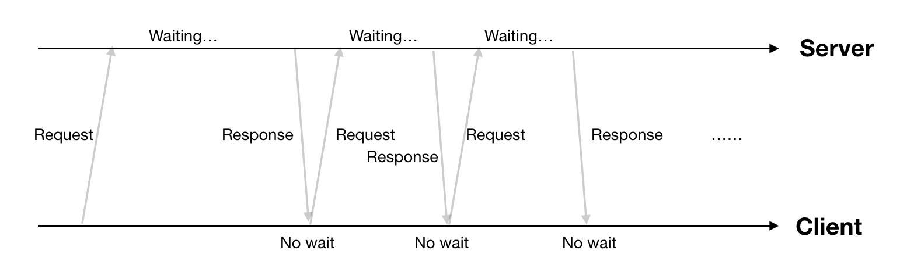
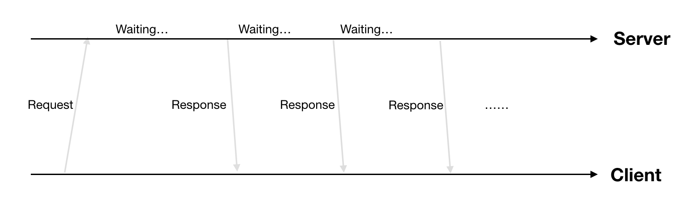
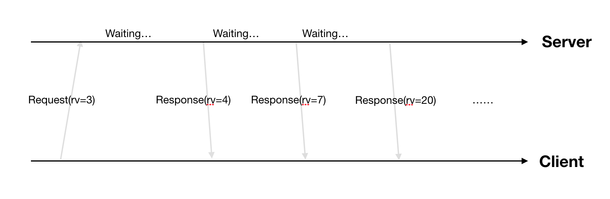
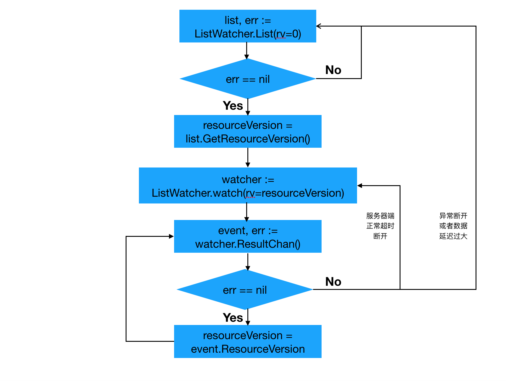

### 1. kubernetes组件间消息(数据)异步通知需求
kube-controller-manager创建完pod后，ETCD中新创建的pod如何通知给kube-scheduler。而kube-scheduler调度完pod后(更新node.spec.nodeName)，ETCD中的pod变化又怎么通知给kubelet。这些都涉及到kubernetes组件间的消息通知机制。kubernentes系统需要的消息通知机制(或者说数据实时通知机制)，应该满足下面几点要求:
- 需求1: 实时性(即数据变化时，相关组件越快感知越好)
- 需求2: 保证消息的顺序性(即消息要按发生先后顺序送达目的组件。很难想象在Pod创建消息前收到该Pod删除消息时组件应该怎么处理)
- 需求3: 保证消息不丢失或者有可靠的重新获取机制(比如说kubelet和kube-apiserver间网络闪断，需要保证网络恢复后kubelet可以收到网络闪断期间产生的消息)

### 2. kubernetes的解决方案

由于kubernetes系统的采取` Level Trigger`而非`Edge Trigger`的设计理念，所以各组件只需要感知数据最新的状态，而不需要担心错过数据的变化过程。因此在kubernetes中没有像其他的分布式系统中额外引入MQ，降低了系统的整体复杂度(如openstack˙中的rabbitmq， cloudFoundary中的nuts等)。而是简单通过http/2 + protobuffer的方式实现了一套list-watch机制来解决各个组件间的消息通知。

##### 2.1 需求1的解决方案
kubernetes组件间主要通过http/2协议(kubernetes1.5之前采用http1.1，另Go1.7之后开始支持http/2)进行数据交互，满足实时性主要下面2种方案。
- 方案1: http long polling
客户端发起http request，服务端有请求数据时就回复一个response(如没有数据服务端就等到有数据再回复)，客户端收到response后马上又发起新的request，如此往复。具体流程如下图所示:



*方案缺点: 通信消耗大一些(每个response多一个request)*

- 方案2: http streaming
客户端发起http request，服务端有请求数据就回复一个response(回复的http header中会带上"Transfer-Encoding":"chunked")。客户端收到这种header的response后就会继续等待后续数据，而服务端有新的数据时会继续通过这条连接发数据。具体流程如下图所示:



*方案2缺点: 需要对返回数据做定制*

**上面两种方案都有自己的优缺点，在kubernetes中选择了方案2，且在kubernetes中的http streaming请求我们称为watch请求(其实就是一个http get请求)**  

*注: ETCD2中watch功能选用的是方案1*

##### 2.2 需求2的解决方案
kubernetes中为每一个REST数据加了一个ResourceVersion字段，并且该字段的值由ETCD来保证全局单调递增(当ETCD中写入一个数据时，全局ResourceVersion就加1)。这样就保证了不同时刻的数据ResourceVersion不同，并且后产生数据的ResourceVersion较之前数据的ResourceVersion大。这样客户端发起watch请求时，只需要带上请求数据在本地缓存中的最新ResourceVersion，而服务端就根据ResourceVersion从小到大把`大于`客户端ResourceVersion的数据按顺序推送给客户端即可。这样就保证了推送数据的顺序性。

```
// ResourceVersion字段就在REST资源结构体的ObjectMeta中。具体如下: 
type ObjectMeta struct {
	Name string
	GenerateName string 
	Namespace string
	SelfLink string
	UID types.UID
	ResourceVersion string  <-- 保证顺序就靠它了。
	Generation int64
	CreationTimestamp Time
	DeletionTimestamp *Time
	DeletionGracePeriodSeconds *int64
	Labels map[string]string
	Annotations map[string]string
	OwnerReferences []OwnerReference
	Initializers *Initializers
	Finalizers []string
	ClusterName string
}
```

具体如下图所示:



*因为ETCD保证全局单调+1，所以某类数据的RV可能不会逐步+1变化*  

##### 2.3 需求3的解决方案
基于需求1和需求2的解决方案，需求3主要是对异常状况处理的完善。kubernetes中结合watch请求增加了`list请求`，主要做如下两件事情:  

1. watch请求开始之前，先发起一次list请求，获取集群中当前所有该类数据(同时得到最新的ResourceVersion)，之后基于最新的ResourceVersion发起watch请求。  
2. 当watch出错时(比如说网络闪断造成客户端和服务端数据不同步)，重新发起一次list请求获取所有数据，再重新基于最新ResourceVersion来watch。  

kubernetes中的list-watch流程如下:  

具体代码参见： kubernetes/vendor/k8s.io/client-go/tools/cache/reflector.go#ListAndWatch()



> watch处理中的ResourceVersion更新是在watchHandler()中实现的。

综合上面的方案分析，我们可以综合总结一下解决方案: kubernetes中基于ResourceVersion信息采用list-watch(http streaming)机制来保证组件间的数据实时可靠传送。从今往后，我们就统称该方案为list-watch机制*

### 3. watch机制代码实现  
list请求就是普通的http get请求，不管是服务端还是客户端的Go语言实现都非常简单，这里按下不表。具体看看watch请求的底层具体实现: 

- 服务端代码:

  ```
  // @kubernetes/staging/src/k8s.io/apiserver/pkg/endpoints/handlers/watch.go
  func (s *WatchServer) ServeHTTP(w http.ResponseWriter, req *http.Request) {
      ...
  	flusher, ok := w.(http.Flusher)  // 把ResponseWriter转换成Flusher
  	if !ok {
           ...
           return
  	}

  	framer := s.Framer.NewFrameWriter(w)
  	if framer == nil {
  		// programmer error
  		return
  	}
  	e := streaming.NewEncoder(framer, s.Encoder)

  	// ensure the connection times out
  	// 超时时间: 优先使用客户端请求中的TimeoutSeconds值，如果请求中的TimeoutSeconds=0，则使用kube-apiserver的启动参数MinRequestTimeout值(默认为30min)
  	timeoutCh, cleanup := s.TimeoutFactory.TimeoutCh()
  	defer cleanup()
  	defer s.Watching.Stop()

  	// begin the stream
  	w.Header().Set("Content-Type", s.MediaType)
  	// 在header中设置Transfer-Encoding=chunked,表示返回数据为http streaming方式
  	w.Header().Set("Transfer-Encoding", "chunked")
  	w.WriteHeader(http.StatusOK)
  	flusher.Flush()

      ...
  	ch := s.Watching.ResultChan()  // 获取从后端返回数据用的管道
  	for {
  		select {
  		...
  		case <-timeoutCh:        // 服务端5min超时，长连接断开
  			return
  		case event, ok := <-ch:  // 服务端有返回数据
  			if !ok {
  				// End of results.
  				return
  			}

              ...
  			if err := e.Encode(event); err != nil {  // 返回数据序列化处理(protobuffer)
  				...
  				// client disconnect.
  				return
  			}
  			if len(ch) == 0 { // 当后端管道中没有返回数据了，把已经获取到的数据推送给客户端
  				flusher.Flush()
  			}
  		}
  	}
  }
  ```


- 客户端代码:  
  ```
  - 底层http streaming处理代码如下：
  // @kubernetes/staging/src/k8s.io/apimachinery/pkg/watch/streamwatcher.go

  // NewStreamWatcher creates a StreamWatcher from the given decoder.
  func NewStreamWatcher(d Decoder) *StreamWatcher {
  	sw := &StreamWatcher{
  		source: d,
  		// It's easy for a consumer to add buffering via an extra
  		// goroutine/channel, but impossible for them to remove it,
  		// so nonbuffered is better.
  		result: make(chan Event),
  	}
  	go sw.receive()  // 启动独立的协程接受服务端推送的数据
  	return sw
  }

  // 该方法主要供外部异步调用，获取接受到的推送数据.
  func (sw *StreamWatcher) ResultChan() <-chan Event {
  	return sw.result
  }

  // receive reads result from the decoder in a loop and sends down the result channel.
  func (sw *StreamWatcher) receive() {
  	defer close(sw.result)
  	defer sw.Stop()
  	defer utilruntime.HandleCrash()
  	for {
  		// 阻塞处理，当response.Body中有数据时函数返回
  		action, obj, err := sw.source.Decode()
  		if err != nil {
  			switch err {
  			// 服务器端正常断开(如超时时间到)，客户端再次watch建立长连接即可
  			case io.EOF:
  				// watch closed normally
  			// 服务端出错，需要客户端再次list来同步数据
  			case io.ErrUnexpectedEOF:
  				...
  			// 其他错误(如数据延迟过大)，也需要客户端再次list来同步数据
  			default:
  				msg := "Unable to decode an event from the watch stream: %v"
  				if net.IsProbableEOF(err) {
  					glog.V(5).Infof(msg, err)
  				} else {
  					glog.Errorf(msg, err)
  				}
  			}
  			return  // 当有错误时，退出watch处理
  		}
  		// 当成功获取到数据时，返回数据放入管道(注意是阻塞的)，然后继续循环等待新的数据
  		sw.result <- Event{
  			Type:   action,
  			Object: obj,
  		}
  	}
  }

  - 调用http streaming的watch处理代码如下：
  // kubernetes/vendor/k8s.io/client-go/rest/request.go
  func (r *Request) Watch() (watch.Interface, error) {
  	...
  	return watch.NewStreamWatcher(restclientwatch.NewDecoder(decoder, r.serializers.Decoder)), nil
  }
  ```

### 4. list-watch机制的几点考虑
1. list请求是返回全量的数据，如果数据量较大时(比如20wPod)，如果watch失败后需要relist，这时候的list请求成本是很高的。(服务端和客户端都需要对20w数据进行编解码，序列化和反序列化等)。kubernetes大规模应用场景下，需要尽量减少relist发生次数。
2. watch请求采用http streaming方式，http1.1时(kubernetes1.5前)因为长连接是独立的TCP连接，假如网络断了，客户端是感知不到网络断开的，而只是以为服务端一直没有数据。tcp keep-alive机制检测到网络断开后(golang默认http client的keep-alive时间是30s)，会主动rst掉该连接，然后再次建立新的连接。而在http/2(大于kubernetes1.5中使用)中因为大家共用一条TCP连接，客户端不断的各种请求导致keep-alive机制无法发挥作用，最后只能由数据的重传超时来reset掉这条TCP连接，这种场景下对系统的影响可能要大一些。  
3. 同时kubernetes1.5之前http1.1中每个REST资源的list-watch都有一条长连接，这样对服务器压力很大。不过这个问题因为http/2的连接复用机制，在kubernetes1.5后得到了很好的解决。从这点考虑建议大家尽量使用kubernetes1.5以后的版本。    
5. tcp长连接断开考虑: 因为watch请求是http streaming方式，客户端不清楚服务端是否还有数据需要发送，所以客户端一般不会主动关闭长连接。需要断开长连接时，应该考虑由服务端来断开。  
6. 如果客户端挂掉后，服务端同样不知道，这样在kubernets1.5之前(因为使用http1.1)服务端维护大量的无效连接，造成服务端资源的大量浪费。kubernetes的解决方案是: watch请求中带一个超时参数(TimeoutSeconds)，默认为5~10min间的随机数。所以服务端只要超时时间一到就会断开连接。为什么是5~10min并没有相关介绍，我的考虑是服务端断开连接，time_wait将砸在服务端的手里。而time_wait的有效时间为1min~4min，所以5~10min是一个比较好的选择，可以保证服务端的time_wait保持在一个比较稳定的数量。
6. kubernetes1.3之前组件通信主要采用http1.1+json的方式。当集群规模增大时，组件间通信数据的序列化和反序列化耗时明显增大，所以组件间通信数据的序列化协议逐步调整为protobuffer了。kubernetes1.7中已经全部为protobuffer了。 